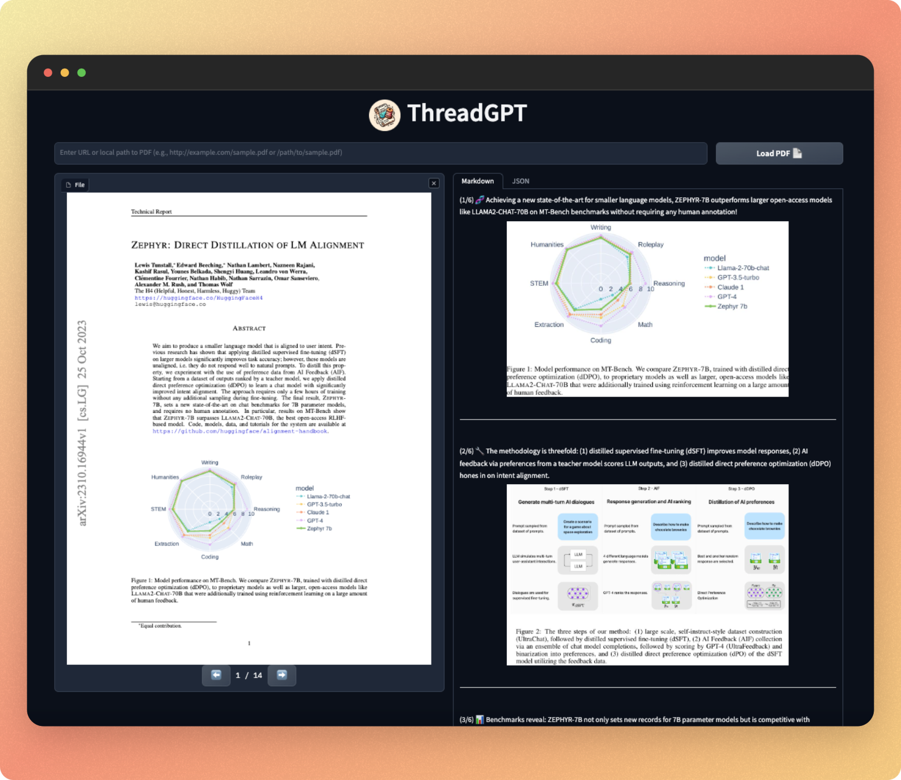
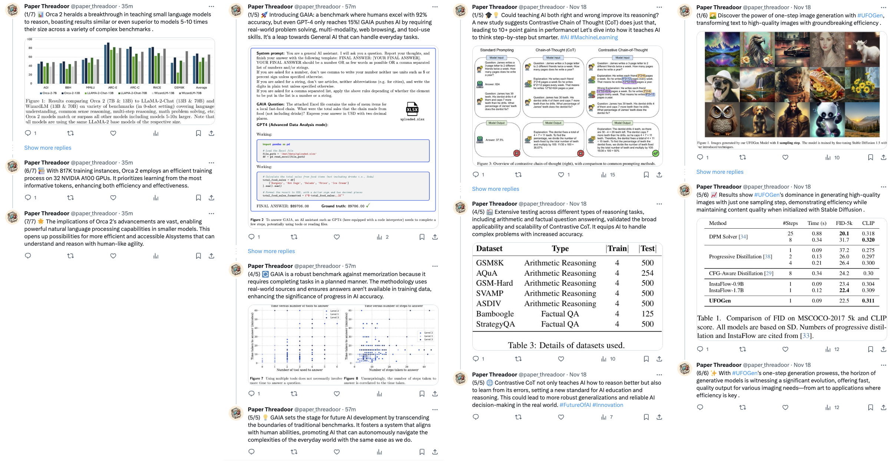

<h1 align="center">ThreadGPT</h1>
<p align="center">
  
</p>

Struggling to keep up with the latest AI research papers? **ThreadGPT** is here to help. It seamlessly transforms complex academic papers into concise, easy-to-understand threads. Not only does it summarize the text, but it also includes relevant figures, tables, and visuals from the papers directly into the threads. 🧵✨📄

<p align="center">
  
  <br>
  <i>Gradio App UI</i>
</p>

<p align="center">
  
  <br>
  <i>Examples of threads generated by ThreadGPT (<a href="https://twitter.com/paper_threadoor">@paper_threadoor</a>)</i>
</p>

## 🛠️ Installation

### Clone the repo

```bash
git clone https://github.com/wiskojo/thread-gpt
```

### Install dependencies

```bash
# Install PyTorch, torchvision, and torchaudio
# Please refer to the official PyTorch website (https://pytorch.org) for the installation command that matches your system. Example:
pip install torch==2.0.0 torchvision==0.15.1

# Install all other dependencies
pip install -r requirements.txt
```

### Configure environment variables

Copy the `.env.template` file and fill in your `OPENAI_API_KEY`.

```bash
cp .env.template .env
```

## 🚀 Getting Started

Before proceeding, please ensure that all the installation steps have been successfully completed.

### 🚨 Cost Warning

Please be aware that usage of GPT-4 with the assistant API can incur high costs. Make sure to monitor your usage and understand the pricing details provided by OpenAI before proceeding.

### Gradio

```bash
python app.py
```

### CLI

#### 🧵 Create Thread

To create a thread, you can either provide a URL to a file or a local path to a file. Use the following commands:

```bash
# For a URL
python thread.py <URL_TO_PDF>

# For a local file
python thread.py <LOCAL_PATH_TO_PDF>
```

By default, you will find all outputs under `./data/<PDF_NAME>`. It will have the following structure.

```
./data/<PDF_NAME>/
├── figures/
│   ├── <figure_1_name>.jpg
│   ├── <figure_2_name>.png
│   └── ...
├── <PDF_NAME>.pdf
├── results.json
├── thread.json
├── processed_thread.json
└── processed_thread.md
```

The final output for user consumption is located at `./data/<PDF_NAME>/processed_thread.md`. This file is formatted in Markdown and can be conveniently viewed using any Markdown editor.

#### All Contents

1. `figures/`: This directory contains all the figures, tables, and visuals that have been extracted from the paper.
2. `<PDF_NAME>.pdf`: This is the original PDF file.
3. `results.json`: This file contains the results of the layout parsing. It includes an index of all figures, their paths, and captions that were passed to OpenAI.
4. `thread.json`: This file contains the raw thread that was generated by OpenAI before any post-processing was done.
5. `processed_thread.json`: This file is a post-processed version of `thread.json`. The post-processing includes steps such as removing source annotations and duplicate figures.
6. `processed_thread.md`: This is a markdown version of `processed_thread.json`. It is the final output provided for user consumption.

#### 📨 Share Thread

To actually share the thread on X/Twitter, you need to set up the credentials in the `.env` file. This requires creating a [developer account](https://developer.twitter.com/) and filling in your `CONSUMER_KEY`, `CONSUMER_SECRET`, `ACCESS_KEY`, and `ACCESS_SECRET`. Then run this command on the created JSON file:

```bash
python tweet.py ./data/<PDF_NAME>/processed_thread.json
```

#### 🔧 Customize Assistant

ThreadGPT utilizes OpenAI's assistant API. To customize the assistant's behavior, you need to modify the `create_assistant.py` file. This script has defaults for the prompt, name, tools, and model (`gpt-4-1106-preview`). You can customize these parameters to your liking.
